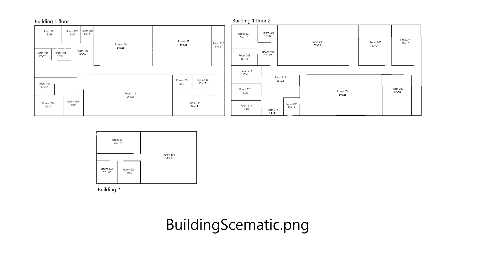

# 
**Case Study #1**
 
 By Julian Mato-Hernandez & Evan Jurdan 

# Executive summary:
For this network the customer needed a nearly complete ground up design of their network. This network contains new equipment (PC, Laptops, Infrastructure, and security devices) along with a host of software (Email, Storage, Network Monitoring, and security). The customer needs these basic services to be as reliable and functional as possible. We will be providing a cloud based work environment centered around Microsoft Azure, this will provide AD, Storage, backups, email, notifications, and parts of security. Along with this cloud infrastructure we will be providing a Full unified wired and wireless network to both buildings. 
 
 
 

# Introduction:
    
## Project Outline
In this paper we will be discussing all components of the customers network that where addressable along with recommendations for next steps. This network has a breath of constraints including but not limited to needing to connect both buildings, providing inter department file transfer, internet access, wireless networking, reliability, budget in expandability, and all within $100,000. We chose a cloud hybrid solution to maximise reliability and expandability along with easing the cost of onsight IT with service contracts from a cloud provider.

## Document Outline
- [Executive summary](#executive-summary)
- [Introduction](#introduction)
    - [Project Outline](#project-outline)
    - [Document Outline](#document-outline) 
- [Requirements Analysis](#requirements-analysis)
    - [General Requirements](#general-requirements)
    - [Hardware Requirements](#hardware-requirements)
    - [Software Requirements](#software-requirements)
- [Customer Synopsis](#customer-synopsis)
- [Network Architecture](#network-architecture)
    -[Three tier architecture](#three-tier-architecture)
- [Network Maps](#network-maps)
    - [Building Scematic](#building-scematic)
    - [Drops And Host Names](#drops-and-host-names)
- [Populating the Network](#populating-the-network)
    - [Device Map](#device-map)
- [Budget / Justification](#budget--justification)
- [Scalability Considerations](#scalability-considerations)
- [Summary and Comments for Future Growt](#summary-and-comments-for-future-growt)
 
 
 

# Requirements Analysis:

## General Requirements     
Lorem ipsum dolor sit amet, consectetur adipiscing elit, sed do eiusmod tempor incididunt ut labore et dolore magna aliqua. Nisl nunc mi ipsum faucibus vitae aliquet nec. Habitant morbi tristique senectus et netus et malesuada. Massa eget egestas purus viverra accumsan in nisl. Consequat interdum varius sit amet mattis vulputate enim nulla aliquet. Id aliquet risus feugiat in ante metus dictum at tempor. Diam quam nulla porttitor massa id neque aliquam vestibulum. Habitant morbi tristique senectus et netus et malesuada fames ac. Est ullamcorper eget nulla facilisi. Leo in vitae turpis massa sed elementum tempus egestas sed. Cursus in hac habitasse platea dictumst quisque. Fermentum odio eu feugiat pretium nibh ipsum consequat. Congue mauris rhoncus aenean vel. Condimentum vitae sapien pellentesque habitant morbi tristique.
 
 

## Hardware Requirements    
Nulla facilisi cras fermentum odio eu. Pulvinar elementum integer enim neque volutpat. Gravida quis blandit turpis cursus in. Vitae sapien pellentesque habitant morbi tristique. Diam vel quam elementum pulvinar etiam non quam lacus. Elit scelerisque mauris pellentesque pulvinar pellentesque habitant morbi tristique senectus. Quisque non tellus orci ac auctor augue mauris. Dignissim convallis aenean et tortor at risus viverra adipiscing at. Scelerisque viverra mauris in aliquam sem fringilla ut morbi. Pharetra vel turpis nunc eget lorem dolor sed viverra. Ut tellus elementum sagittis vitae et leo duis. Id aliquet lectus proin nibh nisl condimentum id venenatis. Tortor dignissim convallis aenean et. Tortor aliquam nulla facilisi cras fermentum odio eu feugiat.
 
 

## Software Requirements    
Lorem ipsum dolor sit amet, consectetur adipiscing elit, sed do eiusmod tempor incididunt ut labore et dolore magna aliqua. Nisl nunc mi ipsum faucibus vitae aliquet nec. Habitant morbi tristique senectus et netus et malesuada. Massa eget egestas purus viverra accumsan in nisl. Consequat interdum varius sit amet mattis vulputate enim nulla aliquet. Id aliquet risus feugiat in ante metus dictum at tempor. Diam quam nulla porttitor massa id neque aliquam vestibulum. Habitant morbi tristique senectus et netus et malesuada fames ac. Est ullamcorper eget nulla facilisi. Leo in vitae turpis massa sed elementum tempus egestas sed. Cursus in hac habitasse platea dictumst quisque. Fermentum odio eu feugiat pretium nibh ipsum consequat. Congue mauris rhoncus aenean vel. Condimentum vitae sapien pellentesque habitant morbi tristique.
 
 
 

# Customer Synopsis:
Nulla facilisi cras fermentum odio eu. Pulvinar elementum integer enim neque volutpat. Gravida quis blandit turpis cursus in. Vitae sapien pellentesque habitant morbi tristique. Diam vel quam elementum pulvinar etiam non quam lacus. Elit scelerisque mauris pellentesque pulvinar pellentesque habitant morbi tristique senectus. Quisque non tellus orci ac auctor augue mauris. Dignissim convallis aenean et tortor at risus viverra adipiscing at. Scelerisque viverra mauris in aliquam sem fringilla ut morbi. Pharetra vel turpis nunc eget lorem dolor sed viverra. Ut tellus elementum sagittis vitae et leo duis. Id aliquet lectus proin nibh nisl condimentum id venenatis. Tortor dignissim convallis aenean et. Tortor aliquam nulla facilisi cras fermentum odio eu feugiat.
 
 
 

# Network Architecture:

## Three tier architecture

 
 
 

# Network Maps:

 
 

## Building Scematic

 
 

## Drops And Host Names

 
 
 

# Populating the Network:

## Device Map

 
 
 

# Budget / Justification:

## Cloud
")

## Final

 
Lorem ipsum dolor sit amet, consectetur adipiscing elit, sed do eiusmod tempor incididunt ut labore et dolore magna aliqua. Nisl nunc mi ipsum faucibus vitae aliquet nec. Habitant morbi tristique senectus et netus et malesuada. Massa eget egestas purus viverra accumsan in nisl. Consequat interdum varius sit amet mattis vulputate enim nulla aliquet. Id aliquet risus feugiat in ante metus dictum at tempor. Diam quam nulla porttitor massa id neque aliquam vestibulum.
 
 
 

# Scalability Considerations:
Lorem ipsum dolor sit amet, consectetur adipiscing elit, sed do eiusmod tempor incididunt ut labore et dolore magna aliqua. Nisl nunc mi ipsum faucibus vitae aliquet nec. Habitant morbi tristique senectus et netus et malesuada. Massa eget egestas purus viverra accumsan in nisl. Consequat interdum varius sit amet mattis vulputate enim nulla aliquet. Id aliquet risus feugiat in ante metus dictum at tempor. Diam quam nulla porttitor massa id neque aliquam vestibulum.
 
 
 

# Summary and Comments for Future Growt:
Lorem ipsum dolor sit amet, consectetur adipiscing elit, sed do eiusmod tempor incididunt ut labore et dolore magna aliqua. Nisl nunc mi ipsum faucibus vitae aliquet nec. Habitant morbi tristique senectus et netus et malesuada. Massa eget egestas purus viverra accumsan in nisl. Consequat interdum varius sit amet mattis vulputate enim nulla aliquet. Id aliquet risus feugiat in ante metus dictum at tempor. Diam quam nulla porttitor massa id neque aliquam vestibulum.